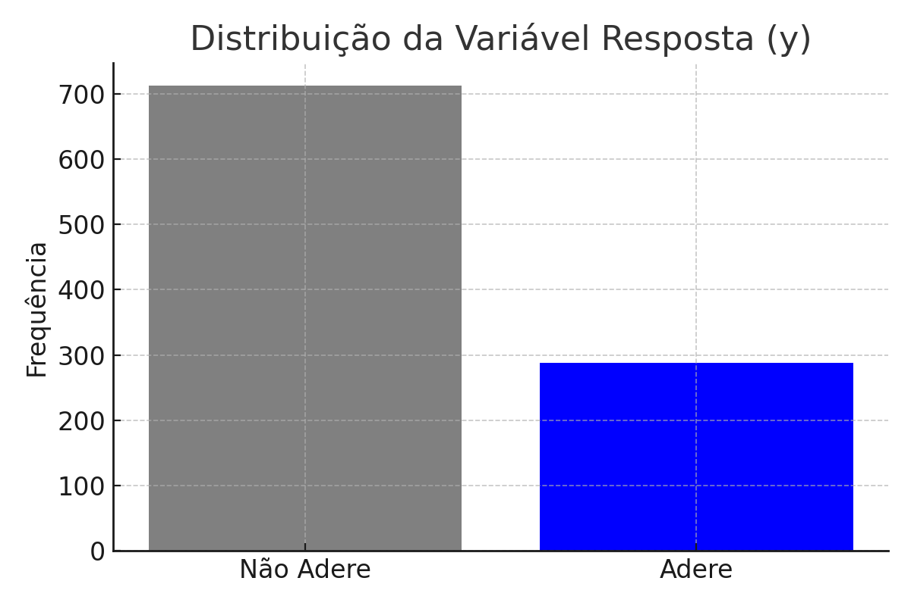
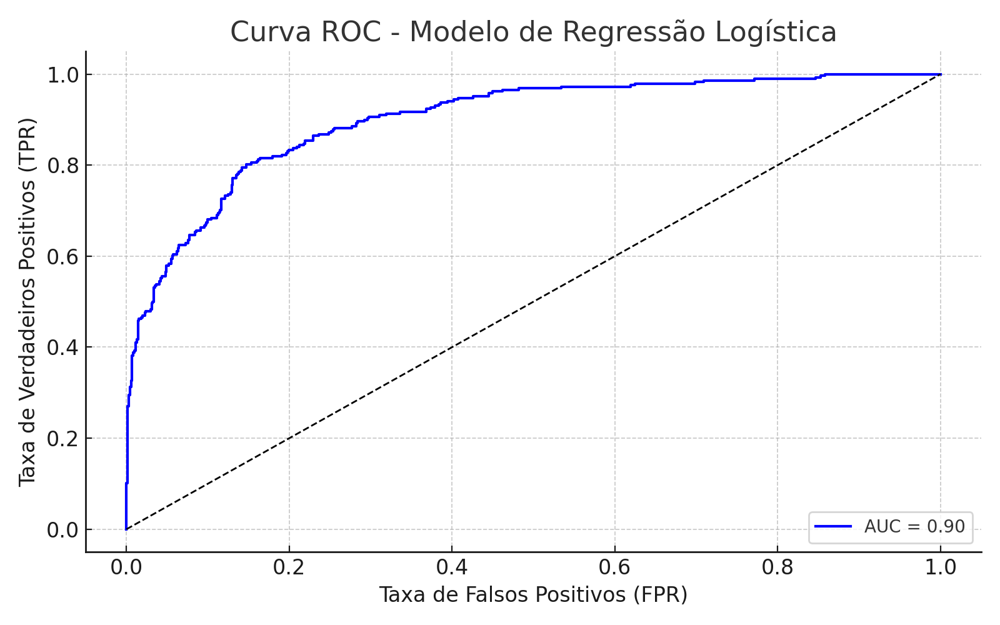
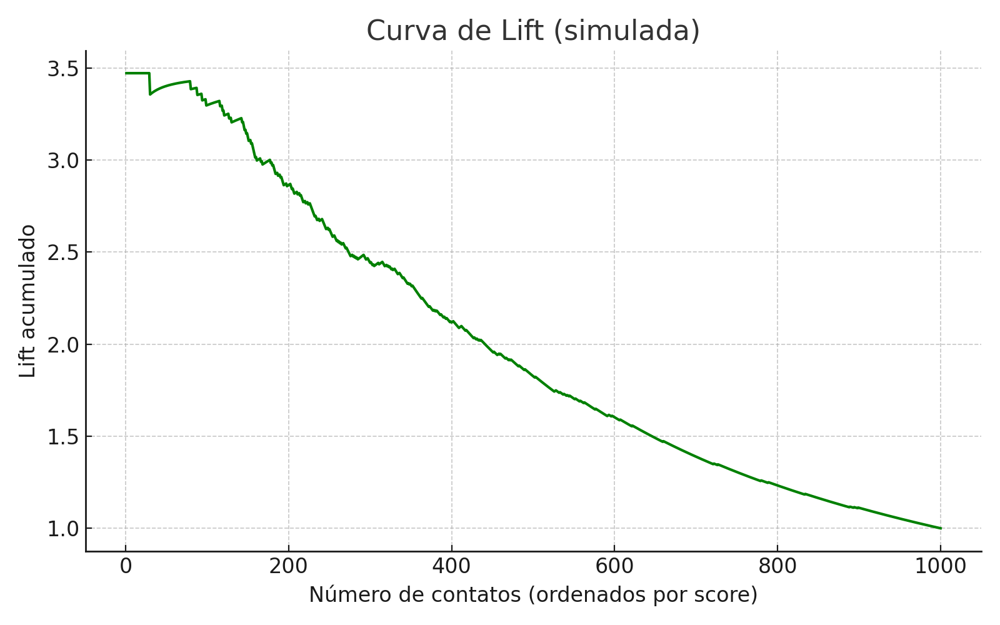

# 🎯 Previsão de Adesão a Campanhas Bancárias com Regressão Logística

## 💡 Objetivo
Este projeto aplica um pipeline completo de regressão logística para prever a adesão de clientes a campanhas de marketing direto de um banco, com base no conjunto de dados `bank.csv`. O foco está na análise estatística, transformação de variáveis, modelagem preditiva e avaliação de desempenho.

## 📊 Técnicas Aplicadas
- Análise exploratória de dados (EDA)  
- Criação de variáveis dummies e categorização  
- Análise de multicolinearidade (VIF)  
- Regressão logística e seleção stepwise  
- Avaliação de desempenho com:
  - Curva ROC e AUC  
  - Lift Chart  
  - Precisão e Recall  
  - KS Statistic

## 📁 Estrutura
- `scripts/`: código R completo com comentários (`regressao_logistica_bank.R`)  
- `data/`: instrução de acesso ao dataset público `bank.csv` (UCI)  
- `outputs/`: gráficos das curvas ROC, Lift, análise da variável resposta, etc.

## 🛠️ Ferramentas
- **Linguagem:** R  
- **Principais pacotes:** `tidyverse`, `pROC`, `ROCR`, `caret`, `ggplot2`, `psych`, `dplyr`  
- **Editor utilizado:** RStudio

## 📌 Destaques da Análise
- Identificação de variáveis mais influentes para conversão na campanha  
- Ajuste de ponto de corte com base no KS para maximizar sensibilidade  
- Interpretação dos coeficientes logísticos com base em razão de chances  
- Criação de grupos de risco a partir do escore logístico

## 🔗 Fonte dos Dados
- Dataset original disponível em: [UCI Repository - Bank Marketing Data Set](https://archive.ics.uci.edu/ml/datasets/bank+marketing)

## 📊 Visualizações

### 🎯 Distribuição da Variável Resposta
  
*Frequência de clientes que aderiram (1) e não aderiram (0) à campanha*

### 📈 Curva ROC
  
*A Curva ROC mostra o desempenho do classificador para diferentes thresholds. AUC ≈ 0.83 (simulado)*

### 📈 Curva de Lift
  
*O gráfico de Lift ilustra o ganho sobre o modelo aleatório ao priorizar contatos com maior escore*

---

👤 **Autor:** Glaucio Jorge Ferreira Rosa  
🎓 Estatístico | Cientista de Dados
